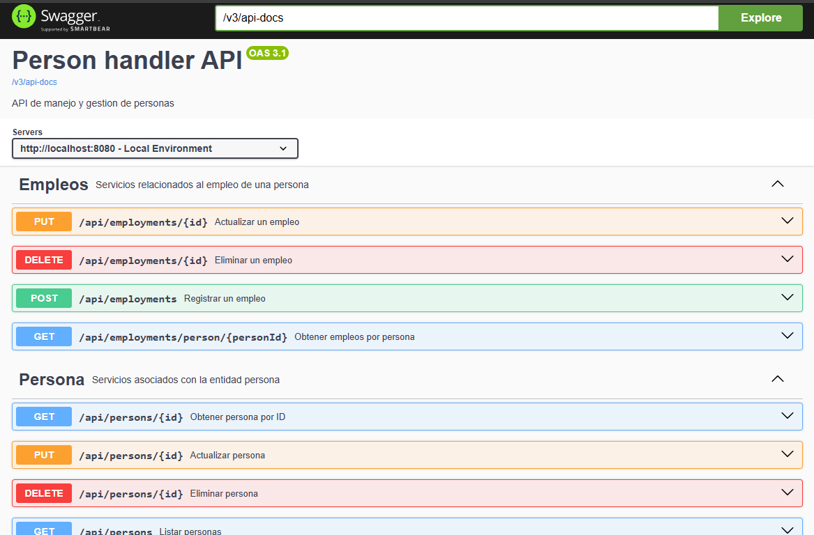

# Spring Boot Microservice - Person API

Este proyecto es un **microservicio en Java con Spring Boot** que permite la gestión de personas, siguiendo buenas prácticas de arquitectura hexagonal (puertos y adaptadores). Está diseñado como una base escalable para sistemas basados en microservicios. Incluye documentación con **Swagger (SpringDoc OpenAPI)** y está preparado para ejecutarse mediante **Docker**.

## 🚀 Tecnologías utilizadas
- Java 17
- Spring Boot 3.4.7
- Spring Web
- Spring Data JPA
- H2 Database
- MapStruct
- Swagger / OpenAPI 3
- Lombok
- Docker
- Gradle

## 📌 Características

- Arquitectura Hexagonal
- CRUD completo de Personas (crear, listar, actualizar, eliminar)
- CRUD parcial de Empleos
- Validaciones y manejo de errores personalizado
- Documentación OpenAPI (Swagger UI)
- Configuración externa mediante `application.properties`
- Uso de base de datos en memoria H2 (ideal para pruebas)
- Mapeo entre entidades y modelos usando MapStruct
- Control global de excepciones
- DTOs para request y response

## 🧱 Estructura del Proyecto

```
├─ src/
    └── main/
       ├── java/
       │ └── com.moradev.spring_microservice/
       │    ├── application/        → Capa de aplicación
       │    │   ├── rest/           → Controladores REST (interfaz HTTP)
       │    │   │ ├── controller/   # Controladores REST (endpoints)
       │    │   │ ├── exception/    # Manejo de excepciones de la capa REST
       │    │   │ ├── model/        # DTOs: request y response
       │    │   │ └── mapper/       # Mapeo entre capa dominio y API
       │    ├── config              → Configuraciones generales
       │    ├── domain/             → Capa de dominio (reglas del negocio)
       │    │   ├── exception/      # Excepciones de negocio personalizadas
       │    │   ├── model/          # Entidades del dominio
       │    │   ├── ports/          # Interfaces de servicios (puertos)
       │    │   └── services/       # Servicios que implementan la lógica de negocio
       │    ├── infrastucture/      → Capa de infraestructura (Persistencia)
       │    │   ├── adapters/       # Adaptadores concretos (implementaciones de puertos) 
       │    │   ├── entity/         # Entidades de persistencia 
       │    │   ├── mapper/         # Mapeo entre entidades y dominio 
       │    │   └── repository/     # Repositorios de persistencia 
       │    └── shared/             → Código compartido entre capa
       │      └── constants/        # Constantes utilizadas en todo el proyecto
       └── resources/
         └── application.properties # Configuraciones generales
```

## 📚 Documentación de la API

Todos los endpoints están documentados automáticamente con Swagger:

- Accede a Swagger UI: http://localhost:8080/swagger-ui/index.html

### 📄 Endpoints disponibles

🔗 Personas (`api/persons`)

| Método | Endpoint             | Descripción                         |
|--------|----------------------|-------------------------------------|
| GET    | `/api/persons`       | Lista todas las personas            |
| GET    | `/api/persons/{id}`  | Obtiene una persona por su ID       |
| POST   | `/api/persons`       | Crea una nueva persona              |
| PUT    | `/api/persons/{id}`  | Actualiza una persona existente     |
| DELETE | `/api/persons/{id}`  | Elimina una persona por su ID       |

🔗 Empleos (`api/employments`)


| Método | Endpoint                                | Descripción                                         |
|--------|-----------------------------------------|-----------------------------------------------------|
| GET    | `/api/employments/person/{personId}`    | Listar todos los empleos de una persona             |
| POST   | `/api/employments`                      | Crear un nuevo empleo para una persona              |
| PUT    | `/api/employments/{id}`                 | Actualizar los datos de un empleo existente por ID  |
| DELETE | `/api/employments/{id}`                 | Eliminar un empleo por su ID                        |

> Vista previa de la api:


## 🛠️ Cómo ejecutar el proyecto

### 1. Clonar el repositorio

```bash
  git clone https://github.com/tu-usuario/spring-microservice-PersonAPI.git
  cd spring-microservice-PersonAPI
```

### 2. Compilar el proyecto

```bash
  ./gradlew clean build
```

### 3. Ejecutar localmente

```bash
  java -jar build/libs/spring_microservice-0.0.1-SNAPSHOT.jar
```

### 4. Ejecutar con Docker
Este proyecto incluye un `Dockerfile` que permite crear una imagen liviana basada en **Amazon Corretto 17 con Alpine**.

```bash
# Construir la imagen Docker
  ./gradlew build
  docker build -t java-spring-app .
  
# Ejecutar el contenedor
  docker run -p 8080:8080 java-spring-app
```

### 5. Verificar
- Accede a la API en:
http://localhost:8080/swagger-ui/index.html

## 🧪 Ejemplo de request (JSON)
Crear persona (POST /persons)

```json
{
  "name": "Wilian",
  "lastName": "Morales",
  "phone": "51-978596589",
  "address": "Av. Los Pipes 123"
}
```
